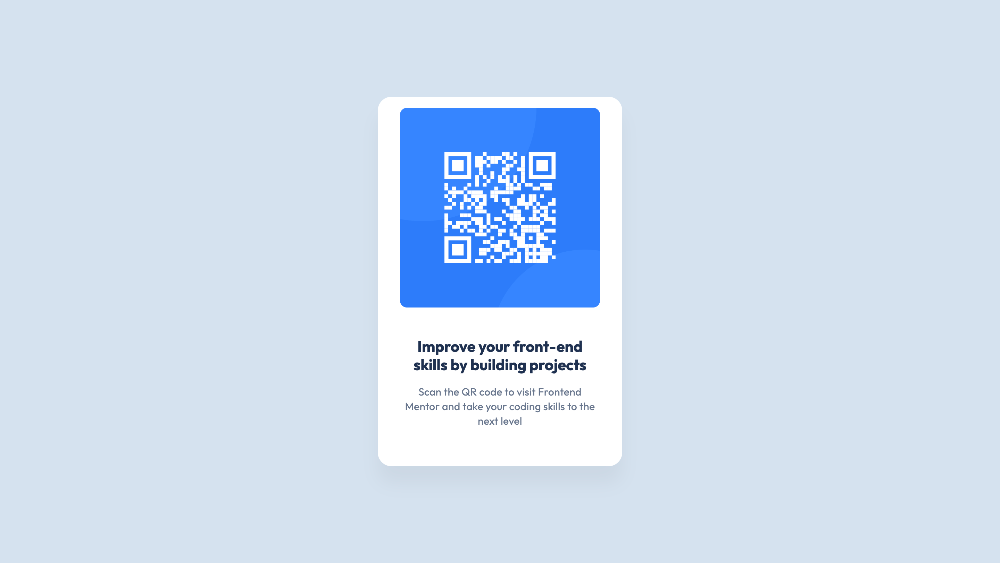

# Frontend Mentor - QR code component solution

This is a solution to the [QR code component challenge on Frontend Mentor](https://www.frontendmentor.io/challenges/qr-code-component-iux_sIO_H). Frontend Mentor challenges help you improve your coding skills by building realistic projects. 

## Table of contents

- [Overview](#overview)
  - [Screenshot](#screenshot)
  - [Links](#links)
- [My process](#my-process)
  - [Built with](#built-with)
  - [What I learned](#what-i-learned)
  - [Continued development](#continued-development)
- [Author](#author)

**Note: Delete this note and update the table of contents based on what sections you keep.**

## Overview

### Screenshot

### Links

- Solution URL: [Solution in Github](https://github.com/monicavieres/qr-code-component-main)
- Live Site URL: [Live Solution in Vercel](https://qr-code-component-main-seven-gold.vercel.app/)

## My process

### Built with

- Semantic HTML5 markup
- CSS custom properties
- Flexbox

### What I learned

In this exercise i applied basic knowledge on html and css. This time im particualrly proud to learned how to apply shadows correctly according to the figma design as i almost never get to work with shadows on my daily work.

### Continued development

In the future i want to keep improving in pixel perfect desgins and use a lot of css
props to extend my knowledge in different kind of designs or designs tha tmay have a little twist.

## Author

- Github - [Monica Cavieres Avila](https://github.com/monicavieres)
- Frontend Mentor - [@yourusername](https://www.frontendmentor.io/profile/monicavieres)
